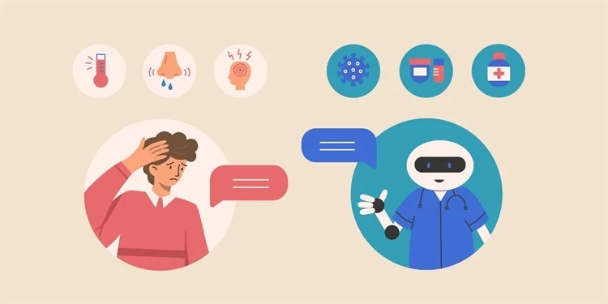
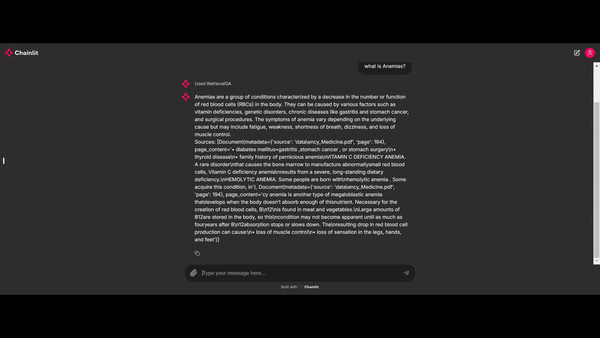

# Medical Chatbot using Llama 2

## Project Overview

This project implements a Medical Chatbot powered by Llama 2 and enhanced with LangChain and Chainlit for conversational AI. The chatbot can assist users with a wide range of medical-related questions, pulling information from a predefined set of documents and answering based on the context provided by the user. The bot integrates Retrieval-Augmented Generation (RAG), enabling it to search and retrieve specific medical knowledge from a corpus of data.

### Features
Medical Question Answering: The bot answers general medical questions based on information stored in documents like encyclopedias and medical resources.

### Retrieval-based QA:
 Uses RetrievalQA to search and retrieve relevant answers from pre-loaded documents.
### User-friendly Interface:
 Built using Chainlit for a seamless web-based interaction experience.
### Powered by Llama 2:
 Uses Llama 2 models for conversational capabilities, ensuring high-quality responses in medical contexts.
## Setup Instructions
* install requirement.txt
* Clone the repository:

Install the Llama 2 model: You will need to load the Llama 2 model for this to work properly. Ensure it's configured correctly in your environment (you may need to use transformers or any other Llama 2-compatible library for this step).

# Example Conversation

